```mermaid
graph LR
    A[Cryptography Basics] --> B[Consensus Mechanisms]
    B --> C[EVM Principles]
    C --> D[Solidity Development]
    D --> E[Toolchain Practice]
    E --> F[Contract Deployment]
    F --> G[Frontend Integration]
    G --> H[Security Audit]
    
    style A fill:#ff6b6b
    style B fill:#4ecdc4
    style C fill:#45b7d1
    style D fill:#96ceb4
    style E fill:#ffeaa7
    style F fill:#dfe6e9
    style G fill:#a29bfe
    style H fill:#fd79a8
```

<div align="center">

# 🚀 Web3_learning

### From Zero to Mastery in Web3 Development

[](LICENSE)
[](https://soliditylang.org/)
[](https://getfoundry.sh/)
[](https://ethereum.org/)

</div>

---

## 📖 Introduction

**Web3_learning** is a systematic learning repository designed for learners from beginner to advanced levels. Through weekly and daily practice notes and hands-on projects, it provides in-depth explanations of core concepts and practical workflows in blockchain and Web3 development.

### 🎯 Learning Path



---

## 🎯 Learning Objectives

<table>
<tr>
<td width="50%">

### 📚 Theoretical Mastery
- ✅ Ethereum/EVM Architecture & Transaction Model
- ✅ Cryptography & Consensus Mechanisms
- ✅ Gas Optimization & Storage Model
- ✅ Smart Contract Security & Audit Essentials

</td>
<td width="50%">

### 💻 Practical Skills
- ✅ Solidity Writing, Testing & Deployment
- ✅ Foundry/Hardhat Toolchain
- ✅ ethers.js/viem Frontend Integration
- ✅ Testnet Deployment & Verification

</td>
</tr>
</table>

---

## 📅 Learning Progress

<div align="center">

| Week | Topic | Progress | Status |
|:---:|:---|:---:|:---:|
| 1️⃣ | Cryptography Basics |  | ✅ Complete |
| 2️⃣ | Consensus Mechanisms |  | ✅ Complete |
| 3️⃣ | EVM Deep Dive |  | ✅ Complete |
| 4️⃣ | Toolchain Practice |  | ✅ Complete |
| 5️⃣ | Advanced Features |  | ✅ Complete |
| 6️⃣ | Multi-Sig Wallet |  | ✅ Complete |
| 7️⃣ | Assembly Optimization |  | 🔄 In Progress |

</div>

---

## 📚 Weekly / Daily Directory

> 💡 **Tip**: Click on file paths to view corresponding notes

###  Week 1 - Cryptography Basics

<details open>
<summary><b>Expand for Details</b></summary>

| Day | 📝 Title | 💡 Brief Summary | 🔗 File Path |
|:---:|:---|:---|:---|
| Day 1 | SHA-256 Principles, Collision Resistance, Avalanche Effect | Introduction to SHA-256 basics, block processing, fixed 256-bit output & security features | [📄 View Notes](./Week_1/Day_1%20%20SHA-256%20原理,%20抗碰撞性,%20雪崩效应.md) |
| Day 2 | Implementing Merkle Tree from Scratch | Hand-coding Merkle Tree in Python, explaining leaf hashing, pairing & light node verification | [📄 View Notes](./Week_1/Day_2%20手写实现%20Merkle%20Tree%20%EF%BC%8C理解其在轻节点验证中的作用.md) |
| Day 3 | Public Key Cryptography: RSA vs ECC | Comparing trapdoor function concepts & implementation differences between RSA & ECC | [📄 View Notes](./Week_1/Day_3%20公钥密码学入门%EF%BC%9ARSA%20与%20ECC%20(椭圆曲线)%20的区别.md) |
| Day 4 | Understanding secp256k1 Curve Equation & Generator Point G | Explaining secp256k1 equation, finite field & significance of generator point G | [📄 View Notes](./Week_1/Day_4%20彻底搞懂%20secp256k1%20曲线方程与生成点%20G.md) |
| Day 5 | ECDSA Signature & Verification (r, s, v) | Deriving ECDSA signature process: random nonce k, point R, calculation of r & s, and modular inverse | [📄 View Notes](./Week_1/Day_5%20数字签名%EF%BC%9AECDSA%20签名与验签流程的数学推导%20(r,%20s,%20v).md) |
| Day 6 | BIP-39 / BIP-32 / BIP-44 Standards | Analyzing mnemonic generation, HD wallet hierarchical derivation & path specifications | [📄 View Notes](./Week_1/Day_6%20%20BIP-39%20(助记词),%20BIP-32%20(HD钱包),%20BIP-44%20(路径)%20标准.md) |
| Day 7 | 🎯 Weekly Project: Implementing a Simple Blockchain | Simulating blockchain core structure with code (Block, previous_hash, nonce, mining & PoW basics) | [📄 View Notes](./Week_1/Day_7%20周实战%EF%BC%9A用代码模拟一个最简单的区块链%EF%BC%88含%20Hash%20链接、挖矿%EF%BC%89.md) |

</details>

---

###  Week 2 - Consensus Mechanisms

<details open>
<summary><b>Expand for Details</b></summary>

| Day | 📝 Title | 💡 Brief Summary | 🔗 File Path |
|:---:|:---|:---|:---|
| Day 1 | Byzantine Generals Problem & CAP Theorem | Explaining BFT, Safety & Liveness concepts and trade-offs | [📄 View Notes](./Week_2/Day_1%20拜占庭将军问题与%20CAP%20定理.md) |
| Day 2 | Bitcoin PoW: Longest Chain & Difficulty Adjustment | Analyzing longest chain principle, fork handling & difficulty adjustment mechanism | [📄 View Notes](./Week_2/Day_2%20比特币%20PoW%20详解%EF%BC%9A最长链原则、难度调整算法.md) |
| Day 3 | Ethereum PoS (Gasper): Epoch/Slot/Attestation | Introducing Slot, Epoch & attestation in Gasper consensus | [📄 View Notes](./Week_2/Day_3%20学习以太坊%20PoS%20(Gasper)%20详解%EF%BC%9AEpoch,%20Slot,%20Attestation.md) |
| Day 4 | LMD-GHOST & Casper FFG | Deep dive into fork choice & finality mechanisms (checkpoint & supermajority link) | [📄 View Notes](./Week_2/Day_4%20深入理解%20LMD-GHOST%20(分叉选择)%20与%20Casper%20FFG%20(最终性).md) |
| Day 5 | Kademlia DHT & Node Discovery | Explaining Kademlia's XOR distance, routing table design & node discovery (Discovery V5) | [📄 View Notes](./Week_2/Day_5%20学习%20Kademlia%20DHT%20算法，理解节点发现机制%20(Discovery%20V5).md) |
| Day 6 | Merkle Patricia Trie (MPT) & State Root | Analyzing MPT structure, three node types & State Root generation process | [📄 View Notes](./Week_2/Day_6%20深入研究%20Patricia%20Merkle%20Trie%20(MPT)，理解%20State%20Root%20的生成.md) |
| Day 7 | Summary of Vitalik's Posts on PoS Security | Summarizing Vitalik's key security perspectives on PoS (nothing-at-stake, slashing, weak subjectivity, etc.) | [📄 View Notes](./Week_2/Day_7%20阅读并总结%20Vitalik%20关于%20PoS%20安全性的博文.md) |

</details>

---

###  Week 3 - EVM Deep Dive

<details open>
<summary><b>Expand for Details</b></summary>

| Day | 📝 Title | 💡 Brief Summary | 🔗 File Path |
|:---:|:---|:---|:---|
| Day 1 | Mastering Ethereum State Transition Function σ' = Υ(σ, T) | Analyzing world state (nonce/balance/storageRoot/codeHash) & state transitions | [📄 View Notes](./Week_3/Day_1%20攻克ethereum%20转换函数.md) |
| Day 2 | Gas Consumption, Logs & Bloom Filter | Explaining EVM Gas pricing, memory expansion & log/Bloom usage | [📄 View Notes](./Week_3/Day_2%20Gas%20消耗计算表，Log%20机制，Bloom%20Filter.md) |
| Day 3 | Storage / Memory / Stack / Calldata Differences | Comparing EVM storage locations with corresponding Gas costs & practical recommendations | [📄 View Notes](./Week_3/Day_3%20详解%20Storage,%20Memory,%20Stack,%20Calldata%20的区别与%20Gas%20成本.md) |
| Day 4 | EIP-1559: BaseFee / PriorityFee / MaxFee | Breaking down EIP-1559 fee model, BaseFee adjustment & refund mechanism | [📄 View Notes](./Week_3/Day_4%20EIP-1559%20详解%EF%BC%9ABaseFee,%20PriorityFee,%20MaxFee%20计算逻辑.md) |
| Day 5 | How Solidity Compiles to Bytecode / Opcode | Explaining compilation process, Creation vs Runtime bytecode & opcode basics | [📄 View Notes](./Week_3/Day_5%20Solidity%20如何编译成%20Bytecode？Opcode%20是什么.md) |
| Day 6 | Precompiled Contracts (ecrecover, sha256, identity) | Explaining precompiled contract concepts, address mapping & calling advantages | [📄 View Notes](./Week_3/Day_6%20学习%20Precompiled%20Contracts%20(ecrecover,%20sha256,%20identity).md) |
| Day 7 | Manually Decoding Input Data (Calldata) | Manual calldata parsing: function selector, parameter packing & practical examples | [📄 View Notes](./Week_3/Day_7%20手动解码%20Input%20Data.md) |

</details>

---

###  Week 4 - Toolchain Practice

<details open>
<summary><b>Expand for Details</b></summary>

| Day | 📝 Title | 💡 Brief Summary | 🔗 File Path |
|:---:|:---|:---|:---|
| Day 1 | Installing & Configuring Foundry, VSCode Plugins | Introduction to Foundry trio (forge/cast/anvil) & installation configuration | [📄 View Notes](./Week_4/Day_1%20安装并配置%20Foundry%20。配置%20VSCode%20插件.md) |
| Day 2 | Forge Test: Writing Your First Unit Test | Process & examples of writing Solidity unit tests with Forge | [📄 View Notes](./Week_4/Day_2%20学习%20Forge%20Test%EF%BC%9A编写第一个单元测试%20(Unit%20Test).md) |
| Day 3 | Cast: Calling RPC Nodes Directly from Terminal | Cast command-line tool examples & JSON-RPC underlying principles | [📄 View Notes](./Week_4/Day_3%20学习%20Cast%20命令行工具%EF%BC%9A在终端直接调用%20RPC%20节点.md) |
| Day 4 | Ethers.js / Viem: Connecting Wallets, Sending Transactions | Explaining provider/signer concepts, library comparison & basic calling process | [📄 View Notes](./Week_4/Day_4%20学习%20Ethers.js%20Viem。连接钱包，发送交易.md) |
| Day 5 | Hand-coding ERC-20 (Without OpenZeppelin) | Implementing ERC-20 from scratch: balance mapping, approve/transferFrom, etc. | [📄 View Notes](./Week_4/Day_5%20开发标准%20ERC-20%20代币合约%20(不使用%20OpenZeppelin，手写).md) |
| Day 6 | Deploying Contracts on Sepolia & Verifying Source Code | Deployment logic, creation/runtime differences & common pitfalls in source verification | [📄 View Notes](./Week_4/Day_6%20在%20Sepolia%20测试网部署合约，%E5%B9%B6验证源码.md) |
| Day 7 | 🎯 Weekly Project: Batch Wallet Generation & Test Token Distribution | Writing scripts to batch generate wallets & perform testnet airdrops (Foundry/cast examples) | [📄 View Notes](./Week_4/Day_7%20周实战%EF%BC%9A编写脚本，批量生成%2010%20个钱包并分发测试币.md) |

</details>

---

###  Week 5 - Advanced Features

<details open>
<summary><b>Expand for Details</b></summary>

| Day | 📝 Title | 💡 Brief Summary | 🔗 File Path |
|:---:|:---|:---|:---|
| Day 1 | delegatecall vs call Differences | Explaining context (msg.sender/storage) differences & delegatecall risks/uses | [📄 View Notes](./Week_5/Day_1%20深入%20delegatecall%20与%20call%20的区别。理解上下文%20(Context)%20传递.md) |
| Day 2 | staticcall / fallback / receive | Analyzing staticcall restrictions & fallback/receive usage & security considerations | [📄 View Notes](./Week_5/Day_2%20深入%20staticcall%20与%20fallback%20%20receive%20函数.md) |
| Day 3 | ABI Encoding Explained: abi.encode vs abi.encodePacked | Comparing encoding differences, collision risks & practical examples | [📄 View Notes](./Week_5/Day_3%20ABI%20编码详解%EF%BC%9Aabi.encode%20vs%20abi.encodePacked.md) |
| Day 4 | Events & Bloom Filter (Off-chain Retrieval) | Event usage, indexed fields & efficient off-chain retrieval methods | [📄 View Notes](./Week_5/Day_4%20事件%20(Events)%20与索引%20(Indexed)。如何在链下高效检索.md) |
| Day 5 | Error Handling: require/assert/revert Gas Differences | Explaining semantic differences & underlying gas consumption of the three & custom error advantages | [📄 View Notes](./Week_5/Day_5%20错误处理%EF%BC%9Arequire,%20assert,%20revert%20(Custom%20Errors)%20的%20Gas%20区别.md) |
| Day 6 | Library Usage & Linking | Explaining Library (internal/linked) & deployment/calling differences & restrictions | [📄 View Notes](./Week_5/Day_6%20库%20(Library)%20的使用与链接%20(using%20for).md) |
| Day 7 | 🎯 Weekly Project: Writing a Proxy Contract | Proxy contract design, Proxy & Implementation separation & storage layout conflict issues | [📄 View Notes](./Week_5/Day_7%20周实战%EF%BC%9A写一个简单的代理合约%20(Proxy%20Contract).md) |

</details>

---

###  Week 6 - Multi-Sig Wallet Project

<details open>
<summary><b>Expand for Details</b></summary>

| Day | 📝 Title | 💡 Brief Summary | 🔗 File Path |
|:---:|:---|:---|:---|
| Day 1 | Multi-Sig Wallet: Design Architecture & State Variables | Multi-sig wallet data structures (owners, threshold, transaction structure) & design points | [📄 View Notes](./Week_6/Day_1%20多签钱包%20(Multi-Sig)%EF%BC%9A设计架构与状态变量.md) |
| Day 2 | Revoke Confirmation & Replace Owner Logic | Multi-sig revoke & owner add/remove constraints & implementation | [📄 View Notes](./Week_6/Day_2%20开发%EF%BC%9A撤销确认与更换所有者逻辑.md) |
| Day 3 | Multi-Sig Wallet Unit Tests (Foundry) | Writing & covering multi-sig logic unit test examples with Foundry | [📄 View Notes](./Week_6/Day_3%20测试%EF%BC%9A编写多签钱包的单元测试，覆盖所有分支.md) |
| Day 4 | Frontend Integration: Scaffold-ETH Multi-Sig Frontend | Using Scaffold-ETH to integrate multi-sig contract into frontend & auto-sync contract info | [📄 View Notes](./Week_6/Day_4%20前端集成%EF%BC%9A用%20Scaffold-ETH%20搭建简单的多签前端.md) |
| Day 5 | 🎯 Deploy Multi-Sig & Demonstrate Multi-Party Signing Process | Deploying multi-sig on testnet & demonstrating complete submit/confirm/execute flow | [📄 View Notes](./Week_6/Day_5%20周实战%EF%BC%9A部署多签钱包到测试网，%E5%B9%B6实际进行一次多人签名流程.md) |
| Day 6 | 📝 To Be Added | — | — |
| Day 7 | 📝 To Be Added | — | — |

</details>

---

###  Week 7 - Assembly & Gas Optimization

<details open>
<summary><b>Expand for Details</b></summary>

| Day | 📝 Title | 💡 Brief Summary | 🔗 File Path |
|:---:|:---|:---|:---|
| Day 1 | Yul (Assembly) Basic Syntax | Yul/Assembly basics (blocks, variables, functions), low-level optimization in assembly | [📄 View Notes](./Week_7/Day_1%20Yul%20(Assembly)%20基础语法%EF%BC%9A块、变量、函数.md) |
| Day 2 | 📝 To Be Added | — | — |
| Day 3 | 📝 To Be Added | — | — |
| Day 4 | Call Operations: call and delegatecall in Assembly | Deep understanding of assembly-level calls, RAW calls, Returndata Buffer mechanism & Gas optimization techniques | [📄 View Notes](./Week_7/Day_4%20调用操作%EF%BC%9A在汇编中进行%20call%20和%20delegatecall.md) |
| Day 5 | 📝 To Be Added | — | — |
| Day 6 | 📝 To Be Added | — | — |
| Day 7 | 📝 To Be Added | — | — |

</details>

---

## 🛠️ Tech Stack

<div align="center">

| Category | Technologies |
|:---:|:---|
| **Smart Contracts** |   |
| **Development Tools** |   |
| **Frontend Integration** |    |
| **Test Networks** |  |
| **Cryptography** |    |

</div>

---

## 🌟 Key Highlights

<table>
<tr>
<td width="33%" align="center">

<h3>📚 Systematic Learning</h3>
<p>From cryptography to frontend<br/>Complete knowledge system</p>
</td>
<td width="33%" align="center">

<h3>🔨 Practice-Oriented</h3>
<p>Weekly hands-on projects<br/>Theory meets practice</p>
</td>
<td width="33%" align="center">

<h3>📈 Progressive Learning</h3>
<p>From beginner to advanced<br/>Step-by-step depth</p>
</td>
</tr>
</table>

---

## 📊 Learning Statistics

<div align="center">

```
Total Learning Days: 49 days
Completed Notes: 35+ articles
Hands-on Projects: 7+ projects
Code Examples: 100+ examples
```

</div>

---

## 🤝 Contributing

Issues and Pull Requests are welcome!

If you find any errors or have suggestions for improvement:
1. 🍴 Fork this repository
2. 🔧 Create your feature branch (`git checkout -b feature/AmazingFeature`)
3. 💾 Commit your changes (`git commit -m 'Add some AmazingFeature'`)
4. 📤 Push to the branch (`git push origin feature/AmazingFeature`)
5. 🎉 Open a Pull Request

---

## 📜 License

This project is licensed under the MIT License - see the [LICENSE](LICENSE) file for details

---

## 🔗 Related Resources

- 📖 [Solidity Official Documentation](https://docs.soliditylang.org/)
- 🛠️ [Foundry Book](https://book.getfoundry.sh/)
- 🌐 [Ethereum.org](https://ethereum.org/)
- 📚 [OpenZeppelin Docs](https://docs.openzeppelin.com/)
- 🔐 [Smart Contract Security Best Practices](https://consensys.github.io/smart-contract-best-practices/)

---

<div align="center">

### ⭐ If this project helps you, please give it a Star!

**Made with ❤️ for Web3 Learners**

</div>
