<div align="center">

# 🚀 Web3_learning

### 从 0 到精通 Web3 开发

[](LICENSE)
[](https://soliditylang.org/)
[](https://getfoundry.sh/)
[](https://ethereum.org/)

</div>

---

## 📖 简介

**Web3_learning** 是一个面向从入门到进阶的系统化学习仓库，通过每周每日的练习笔记与实战项目，深入讲解区块链与 Web3 开发的核心概念与实战流程。

### 🎯 学习路径

```mermaid
graph LR
    A[密码学基础] --> B[共识机制]
    B --> C[EVM 原理]
    C --> D[Solidity 开发]
    D --> E[工具链实战]
    E --> F[合约部署]
    F --> G[前端集成]
    G --> H[安全审计]
    
    style A fill:#ff6b6b
    style B fill:#4ecdc4
    style C fill:#45b7d1
    style D fill:#96ceb4
    style E fill:#ffeaa7
    style F fill:#dfe6e9
    style G fill:#a29bfe
    style H fill:#fd79a8
```



---

## 🎯 学习目标

<table>
<tr>
<td width="50%">

### 📚 理论掌握
- ✅ 以太坊/EVM 架构与交易模型
- ✅ 密码学与共识机制原理
- ✅ Gas 优化与存储模型
- ✅ 合约安全与审计要点

</td>
<td width="50%">

### 💻 实战能力
- ✅ Solidity 编写、测试、部署
- ✅ Foundry/Hardhat 工具链
- ✅ ethers.js/viem 前端集成
- ✅ 测试网部署与验证

</td>
</tr>
</table>

---

## 📅 学习进度

<div align="center">

| Week | 主题 | 进度 | 状态 |
|:---:|:---|:---:|:---:|
| 1️⃣ | 密码学基础 |  | ✅ 完成 |
| 2️⃣ | 共识机制 |  | ✅ 完成 |
| 3️⃣ | EVM 深入 |  | ✅ 完成 |
| 4️⃣ | 工具链实战 |  | ✅ 完成 |
| 5️⃣ | 高级特性 |  | ✅ 完成 |
| 6️⃣ | 多签钱包 |  | ✅ 完成 |
| 7️⃣ | 汇编优化 |  | 🔄 进行中 |

</div>

---

## 📚 每周 / 每日目录

> 💡 **提示**：点击文件路径可直接查看对应笔记内容

###  Week 1 - 密码学基础

<details open>
<summary><b>展开查看详情</b></summary>

| 日期 | 📝 标题 | 💡 简短提要 | 🔗 文件路径 |
|:---:|:---|:---|:---|
| Day 1 | SHA-256 原理、抗碰撞性、雪崩效应 | 介绍 SHA-256 的基本原理、分块处理、固定 256-bit 输出与安全特性 | [📄 查看笔记](./Week_1/Day_1%20%20SHA-256%20原理,%20抗碰撞性,%20雪崩效应.md) |
| Day 2 | 手写实现 Merkle Tree | 用 Python 手写 Merkle Tree，讲解叶子哈希、配对合并与轻节点验证 | [📄 查看笔记](./Week_1/Day_2%20手写实现%20Merkle%20Tree%20%EF%BC%8C理解其在轻节点验证中的作用.md) |
| Day 3 | 公钥密码学：RSA 与 ECC 区别 | 对比 RSA 与 ECC 的陷门函数思想与实现差异 | [📄 查看笔记](./Week_1/Day_3%20公钥密码学入门%EF%BC%9ARSA%20与%20ECC%20(椭圆曲线)%20的区别.md) |
| Day 4 | secp256k1 曲线方程与生成点 G | 讲解 secp256k1 的方程、有限域与生成点 G 的意义 | [📄 查看笔记](./Week_1/Day_4%20彻底搞懂%20secp256k1%20曲线方程与生成点%20G.md) |
| Day 5 | ECDSA 签名与验签 (r, s, v) | 推导 ECDSA 签名流程：临时随机数 k、R 点、r 与 s 的计算与模逆意义 | [📄 查看笔记](./Week_1/Day_5%20数字签名%EF%BC%9AECDSA%20签名与验签流程的数学推导%20(r,%20s,%20v).md) |
| Day 6 | BIP-39 / BIP-32 / BIP-44 标准 | 解析助记词生成、HD 钱包层级推导与路径规范 | [📄 查看笔记](./Week_1/Day_6%20%20BIP-39%20(助记词),%20BIP-32%20(HD钱包),%20BIP-44%20(路径)%20标准.md) |
| Day 7 | 🎯 周实战：实现一个最简单的区块链 | 用代码模拟区块链核心结构（Block、previous_hash、nonce、挖矿与 PoW 简要实现） | [📄 查看笔记](./Week_1/Day_7%20周实战%EF%BC%9A用代码模拟一个最简单的区块链%EF%BC%88含%20Hash%20链接、挖矿%EF%BC%89.md) |

</details>

---

###  Week 2 - 共识机制

<details open>
<summary><b>展开查看详情</b></summary>

| 日期 | 📝 标题 | 💡 简短提要 | 🔗 文件路径 |
|:---:|:---|:---|:---|
| Day 1 | 拜占庭将军问题与 CAP 定理 | 讲解 BFT、Safety 与 Liveness 的概念与权衡 | [📄 查看笔记](./Week_2/Day_1%20拜占庭将军问题与%20CAP%20定理.md) |
| Day 2 | 比特币 PoW：最长链与难度调整 | 解析最长链原则、分叉处理与难度调整机制 | [📄 查看笔记](./Week_2/Day_2%20比特币%20PoW%20详解%EF%BC%9A最长链原则、难度调整算法.md) |
| Day 3 | 以太坊 PoS (Gasper)：Epoch/Slot/Attestation | 介绍 Gasper 共识中的 Slot、Epoch 与 attestation | [📄 查看笔记](./Week_2/Day_3%20学习以太坊%20PoS%20(Gasper)%20详解%EF%BC%9AEpoch,%20Slot,%20Attestation.md) |
| Day 4 | LMD-GHOST 与 Casper FFG | 深入分叉选择与最终性机制（checkpoint 与 supermajority link） | [📄 查看笔记](./Week_2/Day_4%20深入理解%20LMD-GHOST%20(分叉选择)%20与%20Casper%20FFG%20(最终性).md) |
| Day 5 | Kademlia DHT 与节点发现 | 讲解 Kademlia 的 XOR 距离、路由表设计与节点发现（Discovery V5） | [📄 查看笔记](./Week_2/Day_5%20学习%20Kademlia%20DHT%20算法，理解节点发现机制%20(Discovery%20V5).md) |
| Day 6 | Merkle Patricia Trie (MPT) 与 State Root | 解析 MPT 的结构、三种节点类型与 State Root 生成过程 | [📄 查看笔记](./Week_2/Day_6%20深入研究%20Patricia%20Merkle%20Trie%20(MPT)，理解%20State%20Root%20的生成.md) |
| Day 7 | Vitalik 关于 PoS 安全性的博文总结 | 总结 Vitalik 对 PoS 的关键安全观点（nothing-at-stake、slashing、弱主观性等） | [📄 查看笔记](./Week_2/Day_7%20阅读并总结%20Vitalik%20关于%20PoS%20安全性的博文.md) |

</details>

---

###  Week 3 - EVM 深入

<details open>
<summary><b>展开查看详情</b></summary>

| 日期 | 📝 标题 | 💡 简短提要 | 🔗 文件路径 |
|:---:|:---|:---|:---|
| Day 1 | 攻克 Ethereum 转换函数 σ' = Υ(σ, T) | 解析世界状态（nonce/balance/storageRoot/codeHash）与状态转换 | [📄 查看笔记](./Week_3/Day_1%20攻克ethereum%20转换函数.md) |
| Day 2 | Gas 消耗、Log 与 Bloom Filter | 讲解 EVM Gas 定价、内存扩展与日志/Bloom 的用途 | [📄 查看笔记](./Week_3/Day_2%20Gas%20消耗计算表，Log%20机制，Bloom%20Filter.md) |
| Day 3 | Storage / Memory / Stack / Calldata 区别 | 对比 EVM 的存储位置与对应的 Gas 成本与实践建议 | [📄 查看笔记](./Week_3/Day_3%20详解%20Storage,%20Memory,%20Stack,%20Calldata%20的区别与%20Gas%20成本.md) |
| Day 4 | EIP-1559：BaseFee / PriorityFee / MaxFee | 拆解 EIP-1559 的费用模型、BaseFee 调整与退款机制 | [📄 查看笔记](./Week_3/Day_4%20EIP-1559%20详解%EF%BC%9ABaseFee,%20PriorityFee,%20MaxFee%20计算逻辑.md) |
| Day 5 | Solidity 编译到 Bytecode / Opcode | 说明编译流程、Creation vs Runtime bytecode 与 opcode 基础 | [📄 查看笔记](./Week_3/Day_5%20Solidity%20如何编译成%20Bytecode？Opcode%20是什么.md) |
| Day 6 | 预编译合约 (ecrecover, sha256, identity) | 讲解预编译合约的概念、地址映射与调用优势 | [📄 查看笔记](./Week_3/Day_6%20学习%20Precompiled%20Contracts%20(ecrecover,%20sha256,%20identity).md) |
| Day 7 | 手动解码 Input Data（Calldata） | 手动解析 calldata：函数选择器、参数打包与实战示例 | [📄 查看笔记](./Week_3/Day_7%20手动解码%20Input%20Data.md) |

</details>

---

###  Week 4 - 工具链实战

<details open>
<summary><b>展开查看详情</b></summary>

| 日期 | 📝 标题 | 💡 简短提要 | 🔗 文件路径 |
|:---:|:---|:---|:---|
| Day 1 | 安装并配置 Foundry，VSCode 插件 | Foundry 三剑客（forge/cast/anvil）介绍与安装配置 | [📄 查看笔记](./Week_4/Day_1%20安装并配置%20Foundry%20。配置%20VSCode%20插件.md) |
| Day 2 | Forge Test：编写第一个单元测试 | 使用 Forge 编写 Solidity 单元测试的流程与示例 | [📄 查看笔记](./Week_4/Day_2%20学习%20Forge%20Test%EF%BC%9A编写第一个单元测试%20(Unit%20Test).md) |
| Day 3 | Cast：终端直接调用 RPC 节点 | Cast 命令行工具示例与 JSON-RPC 底层原理 | [📄 查看笔记](./Week_4/Day_3%20学习%20Cast%20命令行工具%EF%BC%9A在终端直接调用%20RPC%20节点.md) |
| Day 4 | Ethers.js / Viem：连接钱包、发送交易 | 讲解 provider/signer 概念、库对比与基本调用流程 | [📄 查看笔记](./Week_4/Day_4%20学习%20Ethers.js%20Viem。连接钱包，发送交易.md) |
| Day 5 | 手写 ERC-20（不使用 OpenZeppelin） | 从零实现 ERC-20：余额表、approve/transferFrom 等 | [📄 查看笔记](./Week_4/Day_5%20开发标准%20ERC-20%20代币合约%20(不使用%20OpenZeppelin，手写).md) |
| Day 6 | 在 Sepolia 部署合约并验证源码 | 部署逻辑、creation/runtime 差异与源码验证常见坑 | [📄 查看笔记](./Week_4/Day_6%20在%20Sepolia%20测试网部署合约，%E5%B9%B6验证源码.md) |
| Day 7 | 🎯 周实战：批量生成钱包并分发测试币 | 编写脚本批量生成钱包并进行测试网空投（Foundry/cast 示例） | [📄 查看笔记](./Week_4/Day_7%20周实战%EF%BC%9A编写脚本，批量生成%2010%20个钱包并分发测试币.md) |

</details>

---

###  Week 5 - 高级特性

<details open>
<summary><b>展开查看详情</b></summary>

| 日期 | 📝 标题 | 💡 简短提要 | 🔗 文件路径 |
|:---:|:---|:---|:---|
| Day 1 | delegatecall 与 call 的区别 | 讲解上下文（msg.sender/storage）差异与 delegatecall 风险/用途 | [📄 查看笔记](./Week_5/Day_1%20深入%20delegatecall%20与%20call%20的区别。理解上下文%20(Context)%20传递.md) |
| Day 2 | staticcall / fallback / receive | 解析 staticcall 限制与 fallback/receive 的用途与安全注意事项 | [📄 查看笔记](./Week_5/Day_2%20深入%20staticcall%20与%20fallback%20%20receive%20函数.md) |
| Day 3 | ABI 编码详解：abi.encode vs abi.encodePacked | 比较编码差异、碰撞风险与实战示例 | [📄 查看笔记](./Week_5/Day_3%20ABI%20编码详解%EF%BC%9Aabi.encode%20vs%20abi.encodePacked.md) |
| Day 4 | Event 与 Bloom Filter（链下检索） | Event 的用途、indexed 字段与链下高效检索方法 | [📄 查看笔记](./Week_5/Day_4%20事件%20(Events)%20与索引%20(Indexed)。如何在链下高效检索.md) |
| Day 5 | 错误处理：require/assert/revert 的 Gas 区别 | 解释三者语义差异与底层 gas 消耗与自定义错误优点 | [📄 查看笔记](./Week_5/Day_5%20错误处理%EF%BC%9Arequire,%20assert,%20revert%20(Custom%20Errors)%20的%20Gas%20区别.md) |
| Day 6 | Library 的使用与链接 | 讲解 Library（internal/linked）与部署/调用差异与限制 | [📄 查看笔记](./Week_5/Day_6%20库%20(Library)%20的使用与链接%20(using%20for).md) |
| Day 7 | 🎯 周实战：写代理合约 (Proxy) | 代理合约设计、Proxy 与 Implementation 分离与存储布局冲突问题 | [📄 查看笔记](./Week_5/Day_7%20周实战%EF%BC%9A写一个简单的代理合约%20(Proxy%20Contract).md) |

</details>

---

###  Week 6 - 多签钱包项目

<details open>
<summary><b>展开查看详情</b></summary>

| 日期 | 📝 标题 | 💡 简短提要 | 🔗 文件路径 |
|:---:|:---|:---|:---|
| Day 1 | 多签钱包：设计架构与状态变量 | 多签钱包的数据结构（owners、threshold、交易结构）与设计要点 | [📄 查看笔记](./Week_6/Day_1%20多签钱包%20(Multi-Sig)%EF%BC%9A设计架构与状态变量.md) |
| Day 2 | 撤销确认与更换所有者逻辑 | 多签的撤销（revoke）与 owner 增删的约束与实现 | [📄 查看笔记](./Week_6/Day_2%20开发%EF%BC%9A撤销确认与更换所有者逻辑.md) |
| Day 3 | 多签钱包单元测试（Foundry） | 使用 Foundry 编写并覆盖多签逻辑的单元测试示例 | [📄 查看笔记](./Week_6/Day_3%20测试%EF%BC%9A编写多签钱包的单元测试，覆盖所有分支.md) |
| Day 4 | 前端集成：Scaffold-ETH 多签前端 | 用 Scaffold-ETH 将多签合约接入前端并自动同步合约信息 | [📄 查看笔记](./Week_6/Day_4%20前端集成%EF%BC%9A用%20Scaffold-ETH%20搭建简单的多签前端.md) |
| Day 5 | 🎯 部署多签并演练多人签名流程 | 在测试网部署多签并演示提交/确认/执行的完整流程 | [📄 查看笔记](./Week_6/Day_5%20周实战%EF%BC%9A部署多签钱包到测试网，%E5%B9%B6实际进行一次多人签名流程.md) |
| Day 6 | 📝 待补充 | — | — |
| Day 7 | 📝 待补充 | — | — |

</details>

---

###  Week 7 - 汇编与 Gas 优化

<details open>
<summary><b>展开查看详情</b></summary>

| 日期 | 📝 标题 | 💡 简短提要 | 🔗 文件路径 |
|:---:|:---|:---|:---|
| Day 1 | Yul (Assembly) 基础语法 | Yul/Assembly 基础（块、变量、函数），在 assembly 中做低层优化 | [📄 查看笔记](./Week_7/Day_1%20Yul%20(Assembly)%20基础语法%EF%BC%9A块、变量、函数.md) |
| Day 2 | 内存操作：mload, mstore, mstore8 | 手动管理 Memory 指针，理解内存布局与 Gas 成本优化 | [📄 查看笔记](./Week_7/Day_2%20内存操作%EF%BC%9Amload,%20mstore,%20mstore8。手动管理%20Memory%20指针.md) |
| Day 3 | 存储操作：sload, sstore | 理解 Slot 打包 (Packing) 机制，优化存储布局节省 Gas | [📄 查看笔记](./Week_7/Day_3%20存储操作%EF%BC%9Asload,%20sstore。理解%20Slot%20打包%20(Packing)%20机制.md) |
| Day 4 | 调用操作：在汇编中进行 call 和 delegatecall | 深入理解汇编级调用、RAW 调用、Returndata Buffer 机制与 Gas 优化技巧 | [📄 查看笔记](./Week_7/Day_4%20调用操作%EF%BC%9A在汇编中进行%20call%20和%20delegatecall.md) |
| Day 5 | 位运算技巧：利用 shl, shr, and, or 进行数学计算优化 | 掌握位运算替代乘除法、取模运算，数据打包与解包技巧 | [📄 查看笔记](./Week_7/Day_5%20位运算技巧%EF%BC%9A利用shl,%20shr,%20and,%20or进行数学计算优化.md) |
| Day 6 | 📝 待补充 | — | — |
| Day 7 | 📝 待补充 | — | — |

</details>

---

## 🛠️ 技术栈

<div align="center">

| 分类 | 技术 |
|:---:|:---|
| **智能合约** |   |
| **开发工具** |   |
| **前端集成** |    |
| **测试网络** |  |
| **密码学** |    |

</div>

---

## 🌟 特色亮点

<table>
<tr>
<td width="33%" align="center">

<h3>📚 系统化学习</h3>
<p>从密码学到前端集成<br/>完整的知识体系</p>
</td>
<td width="33%" align="center">

<h3>🔨 实战导向</h3>
<p>每周实战项目<br/>理论与实践结合</p>
</td>
<td width="33%" align="center">

<h3>📈 循序渐进</h3>
<p>从入门到进阶<br/>逐步深入学习</p>
</td>
</tr>
</table>

---

## 📊 学习统计

<div align="center">

```
总学习天数: 49 天
完成笔记: 35+ 篇
实战项目: 7+ 个
代码示例: 100+ 个
```

</div>

---

## 🤝 贡献指南

欢迎提交 Issue 和 Pull Request！

如果你发现任何错误或有改进建议，请：
1. 🍴 Fork 本仓库
2. 🔧 创建你的特性分支 (`git checkout -b feature/AmazingFeature`)
3. 💾 提交你的修改 (`git commit -m 'Add some AmazingFeature'`)
4. 📤 推送到分支 (`git push origin feature/AmazingFeature`)
5. 🎉 开启一个 Pull Request

---

## 📜 许可证

本项目采用 MIT 许可证 - 查看 [LICENSE](LICENSE) 文件了解详情

---

## 🔗 相关资源

- 📖 [Solidity 官方文档](https://docs.soliditylang.org/)
- 🛠️ [Foundry Book](https://book.getfoundry.sh/)
- 🌐 [Ethereum.org](https://ethereum.org/)
- 📚 [OpenZeppelin Docs](https://docs.openzeppelin.com/)
- 🔐 [Smart Contract Security Best Practices](https://consensys.github.io/smart-contract-best-practices/)

---

<div align="center">

### ⭐ 如果这个项目对你有帮助，请给个 Star！

**Made with ❤️ for Web3 Learners**

</div>
