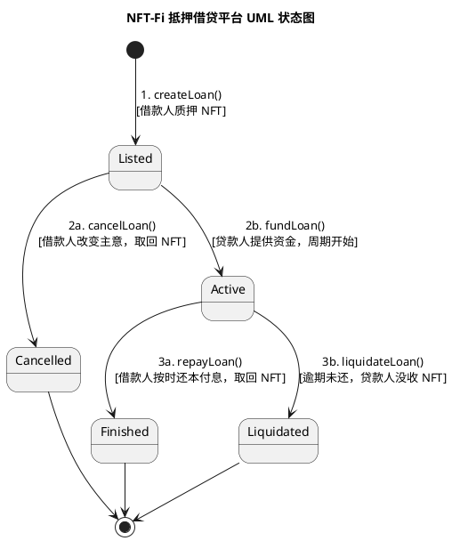
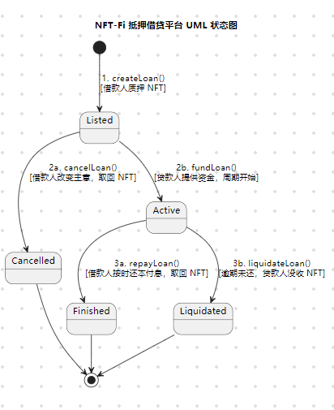
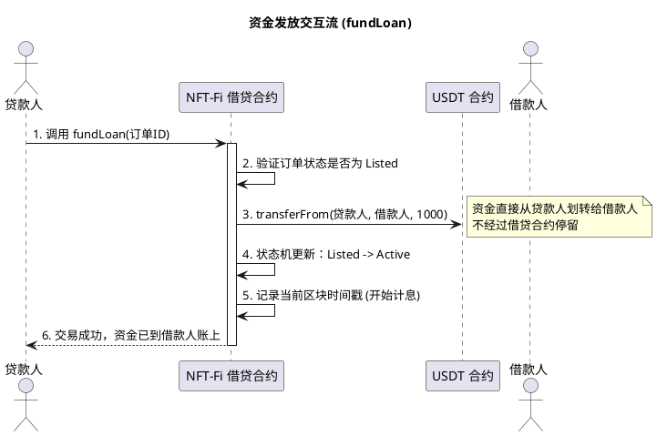

# Day 1：DeFi 基础架构设计 —— NFT-Fi 抵押借贷平台 UML 状态图与合约交互流

> **学习目标**：理解 NFT-Fi 抵押借贷平台的完整生命周期，掌握状态机（State Machine）设计思路，明确合约交互流中的安全要点。

---

## 前言：学习方式的转变

我们彻底转型了，之前的学习模式可能不太适合现在 AI 崛起的时代，接下来我们的篇章将会围绕着 **AI 学习 Web3**，顺应时代，使用 AI 一起学习。

今天学习的目的主要是了解 NFT-Fi 抵押平台的流程。作为 DeFi 开发者，我们在设计这类协议的时候，首要任务是明确**状态机（State Machine）**——因为智能合约本质上就是按严格的规则在不同状态之间流转的程序。

---

## 一、角色分析：三方视角

在设计架构的时候，我们需要带入以下几个视角来考虑：

### 1. 借款人（Borrower）

手里有 NFT，需要流动资金，但是又不想出售资产。他们最关心的是：
- **资金到账速度** —— 能否快速获得流动性
- **抵押物的安全** —— NFT 是否会被恶意处置

### 2. 贷款人（Lender）

手里有资金，想要寻求收益。他们关心的是：
- **利息回报** —— 资金的收益率是否合理
- **违约保障** —— 如果对方违约，自己能否顺利拿到 NFT 作为补偿

### 3. 智能合约（Smart Contract）

处于两者中间的"裁判"。它不相信任何一方，只严格根据预设的代码逻辑：
- 保管 NFT
- 划转资金
- 计算利息

> 💡 **核心理念**：智能合约是去信任化（Trustless）的中间人，所有规则在部署时就已经确定，任何一方都无法单方面篡改。

---

## 二、状态机设计：借贷订单的生命周期

为了最终让 AI 生成准确的 UML 图，我们需要把一笔借贷的完整生命周期一步一步拆开。首先定义借贷订单会产生的**状态（State）**。

### 2.1 状态一：Listed（已上架 / 待认购）

假如现在借款人拿着他的 NFT 访问我们的 DApp，准备发起一笔借款：

- 借款人必须将 NFT **转移并锁定**到我们的智能合约中，这是启动一切的前提条件
- 从智能合约开发者角度来看，这通常涉及借款人调用一个类似 `createLoan()` 或 `list()` 的函数
- 在执行这个函数的时候，合约会把发过来的 NFT 放入合约地址中保存起来

一旦动作成功上链，这笔订单就正式生效了。在 UML 图中，我们把这个初始状态定义为 **`Listed`（已上架）** 或 `Pending`。在这个状态下，NFT 会被锁定在合约里，等待资金的到来。

### 2.2 状态二：Active（进行中）

状态机已经启动，接下来代入第二位核心参与者 —— **贷款人**的视角。

一个贷款人拿着 USDT 在平台浏览，看中了这个 NFT 作为底层资产，觉得这个订单的利息和期限都非常合适。他执行的核心动作就是**把钱给借款人**。

在智能合约开发者看来，贷款人会调用一个类似 `fundLoan()` 的函数，执行这个函数的时候，合约会把贷款人的 USDT 划转给借款人。

就在资金成功划转的这一刻，合约里的这笔订单发生**质的变化**：

1. **倒计时开始**：合约会记录下当前区块的时间戳（`block.timestamp`），借款期限开始倒计时
2. **生息开始**：资金的使用是有成本的，系统开始根据约定的利率计算利息
3. **NFT 锁定性质改变**：原来 NFT 只是锁定在那里，现在变成了**抵押品**。借款人在还清本金和利息或者逾期之前，谁也不能拿走它

我们在实际开发中，通常会使用一个**枚举（Enum）** 类型来定义状态，比如 `LoanState.Active`。

在 `Active` 状态下：

| 角色 | 行为 |
|------|------|
| **借款人** | 拿到钱了，心里惦记着要在到期之前把钱还上 |
| **贷款人** | 安心等待即可，因为他知道有 NFT 给他兜底 |
| **智能合约** | 默默记录时间，有人查询时根据当前时间戳计算出应偿还的本金和利息 |

### 2.3 终态一：Finished（已结清）—— 正常还款

时间一天天过去了，我们先看第一个结局：

假如借款人的资金周转过来了，他想拿回自己心爱的 NFT。在借款结束之前，借款人向智能合约发送还款指令，把**本金 + 利息**还进去。当智能合约确认无误后：

- 把 NFT 退给借款人
- 把钱结算给贷款人
- 订单到达最终状态：**`Finished`（已结清）**

### 2.4 终态二：Liquidated（已清算）—— 逾期清算

第二种情况：在期限之外，借款人依旧没有还钱。贷款人肯定会说：

> "既然对方已经违约了，那合约得把 NFT 给我，来弥补我的损失。"

这时候智能合约就会发起**清算（Liquidation）**：

1. 贷款人发现逾期了，向合约调用一个类似 `liquidateLoan()` 的函数
2. 智能合约收到请求后，判断 `当前区块时间戳 > 约定还款时间戳` 是否成立
3. 如果成立，则立即将抵押物从合约金库转移到贷款人的钱包
4. 状态标记为：**`Liquidated`（已清算）**

### 2.5 边缘场景：Cancelled（已取消）

我们还要考虑边缘场景：

假如借款人把 NFT 锁定到合约了，订单变成了 `Listed` 状态，但是等了几天还是没有人出资，这时候他不想借了，想要把 NFT 拿回自己的钱包。

在这个场景下，借款人需要向智能合约发送一个取回的指令，类似于 `cancelLoan()` 函数，然后订单状态会被标记为 **`Cancelled`（已取消）**。

> ⚠️ **注意**：`cancelLoan()` 只能在 `Listed` 状态下调用，一旦进入 `Active` 状态（贷款人已经出资），借款人就不能单方面取消了。

---

## 三、UML 状态图

### 主流程总结

```
Listed (待认购)  ➔  Active (进行中)  ➔  Finished (已结清) 或 Liquidated (已清算)
```

### PlantUML 状态图源码





### 状态枚举定义（Solidity 参考）

```solidity
// 借贷订单状态枚举
enum LoanState {
    Listed,      // 已上架，等待贷款人出资
    Active,      // 进行中，借贷关系正式生效
    Finished,    // 已结清，借款人正常还款
    Liquidated,  // 已清算，借款人逾期违约
    Cancelled    // 已取消，借款人在出资前取消
}
```

---

## 四、合约交互流详解

骨架已经搭建好了，现在来看**合约交互流的细节部分**，也是最容易出现安全漏洞的地方。

### 4.1 资金发放交互流：`fundLoan()`

回到 `Listed` 变为 `Active` 的那一刻。

**关键问题**：当贷款人调用 `fundLoan()` 函数，把 1000 USDT 打入合约时，这笔钱应该暂存在合约里让借款人自己拿，还是直接转给借款人？

**答案是直接转给借款人。** 理由如下：

- 如果放入合约里等借款人来拿，那么计算利息对借款人不公平（资金并未到手）
- 如果不计算利息，那么对贷款人也不公平

> 💡 **DeFi 架构核心原则**：资金效率（Capital Efficiency）和公平性（Fairness）。在真实的链上世界，智能合约利用了**原子性（Atomicity）** 来保证这种公平 —— `fundLoan()` 中所有的划转动作要么在一瞬间全部完成，要么全部回滚，不存在钱"卡住"的中间状态。

#### 交互时序图（PlantUML）



### 4.2 还款交互流：`repayLoan()`

资金发放的流程已经彻底盘清楚了，现在进入下一个环节 —— 从 `Active` 到 `Finished` 的还款交互。

假设 30 天期限快到了，借款人凑齐了本金和利息，回来调用 `repayLoan()` 准备赎回他心爱的 NFT。

合约在执行的时候，核心需要做以下**三个动作**：

1. **资金流转**：把 1050 USDT（本金 + 利息）从借款人钱包划转到贷款人
2. **退还抵押物**：把锁在合约里的 NFT 退还给借款人
3. **状态更新**：把这笔订单的状态机从 `Active` 更新为 `Finished`

### 4.3 安全要点：CEI 模式防重入攻击

> ⚠️ **重要**：如果上述三个动作的排序错了，黑客就会乘虚而入！

站在审计员的角度，我们必须要避免**重入攻击（Reentrancy Attack）**。为了防范这种攻击，我们必须遵守  **CEI（Checks - Effects - Interactions）安全模式**：

| 步骤 | 阶段 | 动作 | 说明 |
|------|------|------|------|
| 1 | **Checks** | 核对检查 | 这笔订单状态是 `Active` 吗？转入的金额够不够？ |
| 2 | **Effects** | 状态变更 | 核对无误后，**立即**把订单从 `Active` 更新为 `Finished` |
| 3 | **Interactions** | 外部交互 | **最后一步**，才执行真实的资产划转（USDT 和 NFT） |

**为什么这样安全？** 因为我们在第 2 步就已经把状态改为 `Finished`，即使恶意合约在第 3 步重入发起第二次攻击，也会在第 1 步（Checks 阶段）被拦截 —— 因为订单状态已经不是 `Active` 了。

```solidity
// CEI 模式伪代码示例
function repayLoan(uint256 loanId) external {
    // 1. Checks - 检查阶段
    Loan storage loan = loans[loanId];
    require(loan.state == LoanState.Active, "Loan not active");
    require(msg.sender == loan.borrower, "Not borrower");
    uint256 totalDue = loan.principal + calculateInterest(loanId);

    // 2. Effects - 状态变更（先更新状态！）
    loan.state = LoanState.Finished;

    // 3. Interactions - 外部交互（最后才划转资产）
    IERC20(usdt).transferFrom(msg.sender, loan.lender, totalDue);
    IERC721(loan.nftContract).safeTransferFrom(address(this), loan.borrower, loan.tokenId);

    emit LoanRepaid(loanId);
}
```

---

## 五、如何向非技术人员解释架构安全性

假如你需要用通俗易懂的话，向一位完全不懂代码但是准备往里面放 **100 万美金**的投资人解释：为什么在这套架构下，他借出去的钱和抵押物在逻辑上是高度安全的？

建议从以下四个方向阐述：

### 1. 🤝 一手交钱一手交货 —— 资金原子性

所有操作要么全部成功，要么全部失败，不存在"钱付了但 NFT 没收到"的情况。就像银行柜台的当面交易，钱和物同时交换。

### 2. ⚖️ 铁面无私的机械法官 —— 状态机与时间戳

智能合约就是一个"不会打瞌睡、不能被贿赂"的自动法官。它严格按照预设的规则判断每一笔交易，到期不还就自动执行没收，精确到秒。

### 3. 🔒 先盖章再放行 —— CEI 安全模式防重入攻击

合约在执行任何资金操作前，先在"账本上盖章"标记完成。这样即使有人试图利用系统漏洞重复提款，系统一看"已经结案了"，就会直接拒绝。

### 4. ⏰ 精确到秒的自动强制执行 —— 逾期清算逻辑

区块链上的时间是公开透明的，到了约定的还款日期，如果借款人没还钱，贷款人可以一键触发清算，取走 NFT。整个过程没有人为干预的空间，也不需要打官司。

---

## 总结

本节课我们完成了 NFT-Fi 抵押借贷平台的核心架构设计：

| 内容 | 要点 |
|------|------|
| **角色分析** | 借款人、贷款人、智能合约三方视角 |
| **状态机设计** | `Listed` → `Active` → `Finished` / `Liquidated`，边缘场景 `Cancelled` |
| **合约交互流** | `createLoan()` → `fundLoan()` → `repayLoan()` / `liquidateLoan()` |
| **安全模式** | CEI（Checks-Effects-Interactions）防重入攻击 |
| **资金原则** | 原子性保证公平，资金直接划转不停留 |

> **下一步**：尝试用 Solidity 实现这个状态机的基础框架，并编写对应的单元测试。
